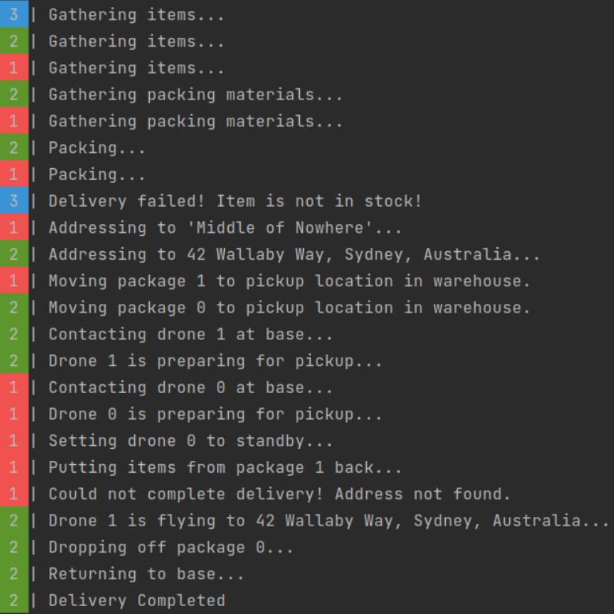

## Intent

The `choreography` pattern is a way to organize microservices which need to work together. It is usually contrasted with
the `orchestration` pattern. Using either of these patterns allows us to create `sagas` which can create more complex
experiences than individual microservices can themselves.

## Explanation

The `choreography` pattern organizes microservices by having them emit `events` to a central bus when they have
completed their work. That central bus will forward the events to other microservices, which will decide how best to
proceed based on the contents of the event.

This is in contrast with an `orchestrator`, which controls the entire flow. The orchestrator will call each microservice
in turn, and make sure that is waits for all the relevant information before it proceeds with downstream requests.

A `saga` is the term for a series of microservice transactions that take place in an organized way. They encapsulate a
number of steps in a larger operation, such as delivering packages from a warehouse to a consumer.

### Real world example

They are named for their real-world counterparts.

> Choreographers teach groups of people how to dance, but the choreographer does not need to be present for the dance
> to be performed. The dancers can react to events, such as the beats in a song, and still perform in unison.

> Orchestras are groups of musicians conducted by a conductor. The conductor needs to be present for the musicians to
> be able to perform in unison. He will not move forward to the next part of the song until all the musicians are ready.

In plain words

> The choreography pattern allows microservices to organize themselves, by providing a central messaging bus for them to communicate

> The orchestrator pattern has a service that manages other microservices, by calling on them when it needs them.

Wikipedia says

> [Service choreography](https://en.wikipedia.org/wiki/Service_choreography) in business computing is a form of service
> composition in which the interaction protocol between several partner services is defined from a global perspective.
> The idea underlying the notion of service choreography can be summarised as follows: "Dancers dance following a global
> scenario without a single point of control"

**Programmatic Example**

In this example, we are ordering a package from a packaging facility. After placing an order, there are 3 steps involved
in getting the package to your house:

- Preparing the package
- Provisioning a delivery drone
- Sending the package out for delivery

Each of these steps has been broken out into a "microservice" which has been approximated by an async call. Each
microservice has a bus that it is able to post to, to notify other microservices of the results of its latest operation.
Broadly, each microservice should have a `SuccessEvent` and a `FailureEvent`.

In the following example, the delivery `saga` can fail in 2 different ways:

- The packaging service can report that the item is not in stock
- The delivery service can report that the requested address is not found

When either of these happens, a failure event specific to that service is broadcasted, and each microservice is given
the opportunity to perform cleanup related to its own data. In the case of the "address not found" failure in the
following scenario, each of the services is given the chance to reverse its transaction when the saga moves into a
failure state.

Program output:

## Class diagram

Image from https://docs.microsoft.com/en-us/azure/architecture/patterns/choreography
## Applicability

Use the Choreography pattern when:

- You need to organize a set of microservices to perform an operation that has multiple steps
- You need to avoid having a single point of failure for your service
- You need to develop applications at scale

In contrast, you should use the orchestrator pattern when:

- You need to organize a set of microservices to perform an operation that has multiple steps
- Your use case is simple and not subject to change
- You have limited network bandwidth

## Known uses

* It is a supported microservice pattern on Azure

## Credits

* https://techrocking.com/microservices-choreography-event-pattern/
* https://docs.microsoft.com/en-us/azure/architecture/patterns/choreography
* https://bluesoft.com/orchestration-vs-choreography-different-patterns-of-getting-systems-to-work-together/
* https://medium.com/ingeniouslysimple/choreography-vs-orchestration-a6f21cfaccae
* https://dev.to/theagilemonkeys/saga-patterns-by-example-fod
* https://medium.com/ci-t/how-to-chain-azure-functions-c11da1048353