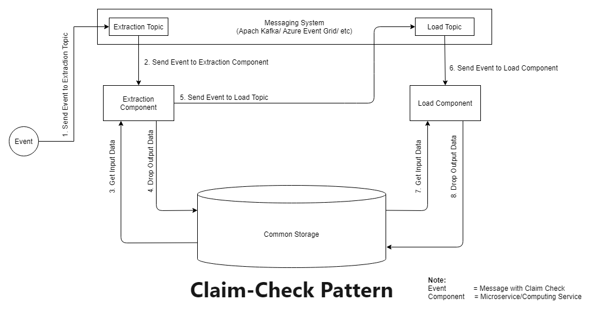
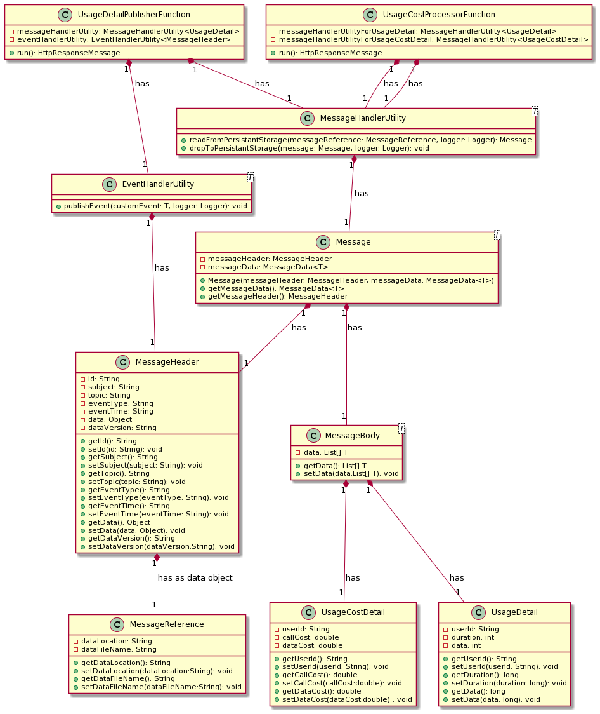

## Name

[Claim Check Pattern](https://docs.microsoft.com/en-us/azure/architecture/patterns/claim-check)

## Also known as

[Reference-Based Messaging](https://www.enterpriseintegrationpatterns.com/patterns/messaging/StoreInLibrary.html)

## Intent

- Reduce the load of data transfer through the Internet
- Data security

## Explanation

Real-World Example

> Suppose if you want to build a photo processing system. You give images as input to process and create different photos of the same image. Once the image is received by the first microservice/rest API, it will store that in persistent storage. To create 10 different images, there are 10 microservices. The first microservice will create a message with a header and body. The header contains the next process to call, the location of input data and the body contains actual data(here it is an image). The first microservice will send 10 different headers to the messaging platform and store the entire message with data in persistent storage. Messaging platform will send the respective message header to the respective microservice. Then these microservices will read the entire message from persistent storage. It will then perform its operation and again store the entire message with a new image.

In Plain words

> Split a large message into a claim check and a payload. Send the claim check to the messaging platform and store the payload to an external service. This pattern allows large messages to be processed while protecting the message bus and the client from being overwhelmed or slowed down. This pattern also helps to reduce costs, as storage is usually cheaper than resource units used by the messaging platform.([ref](https://docs.microsoft.com/en-us/azure/architecture/patterns/claim-check))

## Architecture Diagram

## Applicability

Use the Claim Check Pattern when

- processing data is huge and don't want to consume bandwidth to transfer data through the internet.
- secure your data transfer by storing in common persistent storage.
- you have a cloud platform - Azure Functions or AWS Lambda, Azure EventGrid or AWS Event Bridge, Azure Blob Storage or AWS S3 Bucket.
- each service must be independent. It means it will perform its operations and drop data to storage.
- Pattern follows Publish-Subscribe Model.

## Consequences

- This pattern is stateless. Any compute API will not store any data.
- You must have persistent storage and a reliable messaging platform.

## Class Diagrams

### call-usage-app

## Tutorials

### Workflow

We are building a call cost calculator system. Producer class(UsageDetailPublisherFunction Azure Function) will generate call usage details and send them to the Event Grid topic. The consumer class(UsageCostProcessorFunction) will get triggered by this Event Grid topic event and calculate the cost. It then stores its result in storage. First, UsageDetailPublisherFunction creates a message, sends message header to Event Grid topic usage-detail, and drops an entire message to the blob storage. Event Grid then sent this message header to the UsageCostProcessorFunction Azure function. It will read the entire message with the help of the header, perform its operation, and drop the result to the blob storage.

### Setup

- Any system is fine MacOS, Windows, Linux as everthing is deployed on Azure.
- Install Java JDK 11 and set up environmental variables.
- Install git.
- Install Visual Studio Code.
- Install [extension](https://marketplace.visualstudio.com/items?itemName=ms-azuretools.vscode-azurefunctions) for Azure function in Visual studio code to deploy.

### Run your services

1. Open Spring Tool Suite
2. Import existing project as POM file
3. Run usage-detail-sender as spring boot application
4. Run usage-cost-processor as spring boot application

### Events check command

### Storage Data

The data is stored in the Azure blob storage in the container `callusageapp`. For every trigger, one GUID is created. Under the `GUID folder`, 2 files will be created `input.json` and `output.json`.
`Input.json` is dropped `producer` azure function which contains call usage details.` Output.json` contains call cost details which are dropped by the `consumer` azure function.

## Known uses

1. Extract-Transform-Load workflow
2. Input-Process-Output workflow

## Credits

- [Messaging Pattern - Claim Check](https://www.enterpriseintegrationpatterns.com/patterns/messaging/StoreInLibrary.html)
- [Azure Architecture Pattern - Claim Check Pattern](https://docs.microsoft.com/en-us/azure/architecture/patterns/claim-check)
