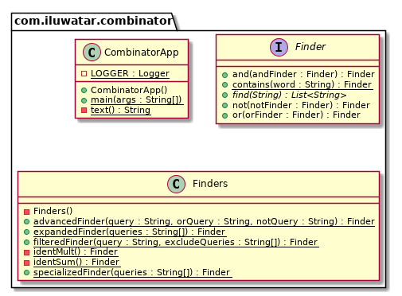

## Also known as
Composition pattern

## Intent
The functional pattern representing a style of organizing libraries centered around the idea of combining functions.  
Putting it simply, there is some type T, some functions for constructing "primitive" values of type T, 
and some "combinators" which can combine values of type T in various ways to build up more complex values of type T.

## Explanation

Real world example

> In computer science, combinatory logic is used as a simplified model of computation, used in computability theory and proof theory. Despite its simplicity, combinatory logic captures many essential features of computation.
> 

In plain words

> Combinators provide means to compose primitives and/or already composed structures into more complex structures.
> 

> A combinator is a function that takes other functions as arguments and returns a new function.
> 

Wikipedia says

> A combinator is a higher-order function that uses only function application and earlier defined combinators to define a result from its arguments.
>

## Class diagram

## Applicability
Use the combinator pattern when:

- You are able to create a more complex value from more plain values but having the same type(a combination of them)

## Real world examples

- java.util.function.Function#compose
- java.util.function.Function#andThen

## Credits

- [Example for java](https://gtrefs.github.io/code/combinator-pattern/)
- [Combinator pattern](https://wiki.haskell.org/Combinator_pattern)
- [Combinatory logic](https://wiki.haskell.org/Combinatory_logic)
