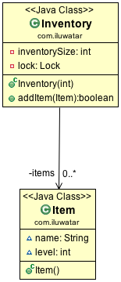

## Intent

Reduce the overhead of acquiring a lock by first testing the
locking criterion (the "lock hint") without actually acquiring the lock. Only
if the locking criterion check indicates that locking is required does the
actual locking logic proceed.

## Class diagram



## Applicability

Use the Double Checked Locking pattern when

* there is a concurrent access in object creation, e.g. singleton, where you want to create single instance of the same
  class and checking if it's null or not maybe not be enough when there are two or more threads that checks if instance
  is null or not.
* there is a concurrent access on a method where method's behaviour changes according to the some constraints and these
  constraint change within this method.

## Explanation

Real-world example

> Picture a computer store where customers can purchase computers and accessories. In this busy store, several cashiers
> assist multiple clients simultaneously. When you request a product, the cashier first checks if it's in stock. If it is,
> they retrieve the storage key. Before heading to the storage area, they double-check that no one else has purchased the
> product in the meantime

In plain words

> Double-checked locking pattern limits the overhead of acquiring lock only to the cases when there is a chance that
> requirements for the operation to be executed are met.

Wikipedia says

> In software engineering, double-checked locking (also known as "double-checked locking optimization") is a software
> design pattern used to reduce the overhead of acquiring a lock by testing the locking criterion (the "lock hint") before
> acquiring the lock. Locking occurs only if the locking criterion check indicates that locking is required.

**Programmatic Example**

We have an Item class and Inventory representing a storage for items. This storage has limited capacity indicated
by `inventorySize` property.

```java
public class Item {
}

public class Inventory {
  private final int inventorySize;
  private final List<Item> items;
  private final Lock lock;

  public Inventory(int inventorySize) {
    this.inventorySize = inventorySize;
    this.items = new ArrayList<>(inventorySize);
    this.lock = new ReentrantLock();
  }
  ...
}
```

We can add an Item to Inventory only when the number of already added items is lower than defined `inventorySize`. We
check this condition twice: first before lock is acquired, to avoid acquiring when there is no chance to add new item,
and the second time after the lock is acquired, because in the meantime other thread may have added item and condition
result may have changed.

```java
public class Inventory {
  ...
  public boolean addItem(Item item) {
    final var threadId = Thread.currentThread().getId();
    if (items.size() < inventorySize) {
      LOGGER.info("ThreadId={}: Item can be added to inventory, trying to acquire lock...", threadId);
      lock.lock();
      try {
        if (items.size() < inventorySize) {
          items.add(item);
          LOGGER.info("ThreadId={}: New item added to inventory, items.size()={}, inventorySize={}", threadId, items.size(), inventorySize);
          return true;
        } else {
          LOGGER.info("ThreadId={}: Cannot add new items to inventory", threadId);
        }
      } finally {
        lock.unlock();
      }
    } else {
      LOGGER.info("ThreadId={}: Cannot add new items to inventory, lock acquiring skipped", threadId);
    }
    return false;
  }
}
```

We can check the following scenario: let's run two threads in parallel, each of them will try to add three items to inventory one by one. Let's set inventorySize to 3. In total there will be 6 attempts to add an item and only 3 of them will finish successfully.

```java
public class App {
  public static void main(String[] args) {
    final var inventory = new Inventory(3);
    var executorService = Executors.newFixedThreadPool(2);
    IntStream.range(0, 2).<Runnable>mapToObj(i -> () -> {
      IntStream.range(0, 3).forEach(j -> {
        inventory.addItem(new Item());
      });
    }).forEach(executorService::execute);
    ...
  }
}
```

Here's the output of some of the program execution. Note output may differ between executions because of unpredictable threads allocation.

```text
Line | Output
   1 | ThreadId=16: Item can be added to inventory, trying to acquire lock...
   2 | ThreadId=15: Item can be added to inventory, trying to acquire lock...
   3 | ThreadId=16: New item added to inventory, items.size()=1, inventorySize=3
   4 | ThreadId=16: Item can be added to inventory, trying to acquire lock...
   5 | ThreadId=15: New item added to inventory, items.size()=2, inventorySize=3
   6 | ThreadId=15: Item can be added to inventory, trying to acquire lock...
   7 | ThreadId=16: New item added to inventory, items.size()=3, inventorySize=3
   8 | ThreadId=16: Cannot add new items to inventory, lock acquiring skipped
   9 | ThreadId=15: Cannot add new items to inventory
  10 | ThreadId=15: Cannot add new items to inventory, lock acquiring skipped
```

In line `6` we can see that thread `15` already checked that new item can be added, as at this point there are 2 of 3 items already added to the inventory.
In line `7` we can see that thread `16` adds new item. Now there are 3 items in the inventory, so it is full and cannot take more items.
In line `9` thread `15` checks one again, after acquiring the lock. It turns out that inventory is full, so item cannot be added.
In lines `8` and `10` we can see that inventory is already full, so lock acquiring is skipped.
