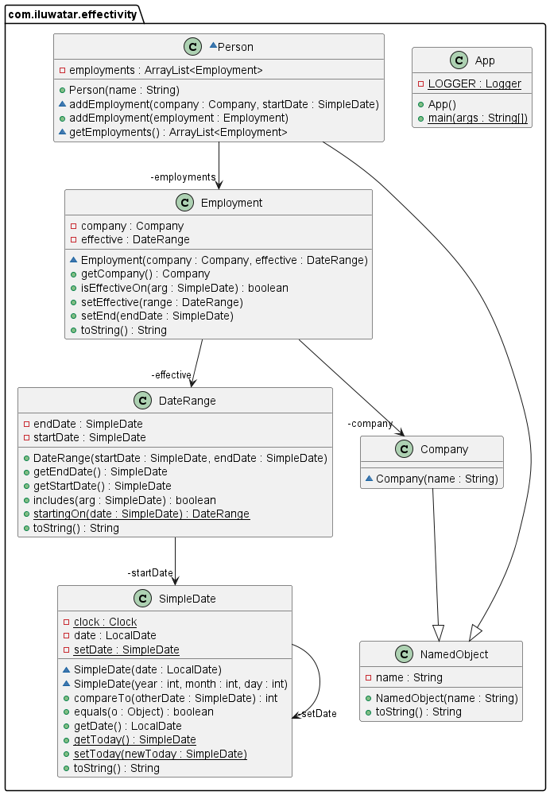

--- 
layout: pattern
title: Effectivity
folder: effectivity
permalink: /patterns/effectivity/
categories: Creational
language: en 
tags:
 - Data access
---

## Name / classification

Effectivity.

## Also known as

Effective Dating, Temporal Database Design.

## Intent

Add a time period to an object to show when it is effective.

## Explanation

Real-world example

> An individual is employed at different companies over different periods of time during their 
> life. It is useful to know if their employment at a certain position is effective during 
> different points in time.

In plain words

> Effectivity pattern lets you specify a time period over which an object is effective.

[Martin Fowler](https://martinfowler.com/eaaDev/Effectivity.html) says
> Many facts are true only for a certain period of time. So an obvious way to describe these 
> facts is to mark them with a period of time. For many that period is a pair of dates, however 
> Range can be used here to make that date range an object.
>
>Once defined, effectivity ranges are then used in queries to return the appropriate objects 
> that are effective on a certain date.

## Class diagram

## Applicability

Use the Effectivity pattern when
* You have a simple situation for temporal behaviour.
* It makes sense that the objects should be temporal.

## Consequences

Effectivity pattern allows for simple temporal behaviour that relies on client awareness for 
processing.

## Related patterns

* [Temporal Property](https://martinfowler.com/eaaDev/TemporalProperty.html)
* [Temporal Object](https://martinfowler.com/eaaDev/TemporalObject.html)

## Credits

* [Martin Fowler](https://martinfowler.com/eaaDev/Effectivity.html)
* [Sam Bendayan](http://www.sqlservercentral.com/articles/Effective+Dating/67806/)