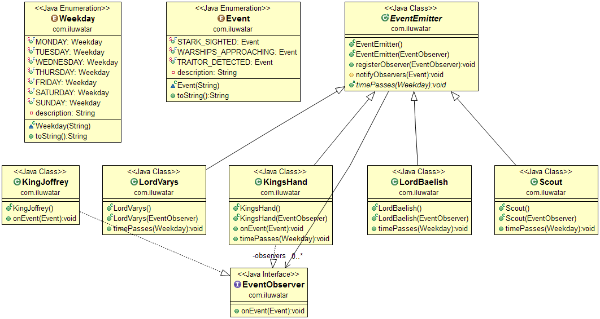

## Name

Event Aggregator

## Intent
A system with lots of objects can lead to complexities when a
client wants to subscribe to events. The client has to find and register for
each object individually, if each object has multiple events then each event
requires a separate subscription. An Event Aggregator acts as a single source
of events for many objects. It registers for all the events of the many objects
allowing clients to register with just the aggregator.

## Explanation

Real-world example

> King Joffrey sits on the iron throne and rules the seven kingdoms of Westeros. They receives most
> of their critical information from King's Hand, the second in command. King's hand has many
> close advisors himself, feeding them with relevant information about events occurring in the
> kingdom.

In Plain Words

> Event Aggregator is an event mediator that collects events from multiple sources and delivers
> them to registered observers.

**Programmatic Example**

In our programmatic example, we demonstrate the implementation of an event aggregator pattern. Some of
the objects are event listeners, some are event emitters, and the event aggregator does both.

```java
public interface EventObserver {
  void onEvent(Event e);
}

public abstract class EventEmitter {

  private final Map<Event, List<EventObserver>> observerLists;

  public EventEmitter() {
    observerLists = new HashMap<>();
  }

  public final void registerObserver(EventObserver obs, Event e) {
    ...
  }

  protected void notifyObservers(Event e) {
    ...
  }
}
```

`KingJoffrey` is listening to events from `KingsHand`.

```java
@Slf4j
public class KingJoffrey implements EventObserver {
  @Override
  public void onEvent(Event e) {
    LOGGER.info("Received event from the King's Hand: {}", e.toString());
  }
}
```

`KingsHand` is listening to events from their subordinates `LordBaelish`, `LordVarys`, and `Scout`.
Whatever they hears from them, they delivers to `KingJoffrey`.

```java
public class KingsHand extends EventEmitter implements EventObserver {

  public KingsHand() {
  }

  public KingsHand(EventObserver obs, Event e) {
    super(obs, e);
  }

  @Override
  public void onEvent(Event e) {
    notifyObservers(e);
  }
}
```

For example, `LordVarys` finds a traitor every Sunday and notifies the `KingsHand`.

```java
@Slf4j
public class LordVarys extends EventEmitter implements EventObserver {
  @Override
  public void timePasses(Weekday day) {
    if (day == Weekday.SATURDAY) {
      notifyObservers(Event.TRAITOR_DETECTED);
    }
  }
}
```

The following snippet demonstrates how the objects are constructed and wired together.

```java
    var kingJoffrey = new KingJoffrey();

    var kingsHand = new KingsHand();
    kingsHand.registerObserver(kingJoffrey, Event.TRAITOR_DETECTED);
    kingsHand.registerObserver(kingJoffrey, Event.STARK_SIGHTED);
    kingsHand.registerObserver(kingJoffrey, Event.WARSHIPS_APPROACHING);
    kingsHand.registerObserver(kingJoffrey, Event.WHITE_WALKERS_SIGHTED);

    var varys = new LordVarys();
    varys.registerObserver(kingsHand, Event.TRAITOR_DETECTED);
    varys.registerObserver(kingsHand, Event.WHITE_WALKERS_SIGHTED);

    var scout = new Scout();
    scout.registerObserver(kingsHand, Event.WARSHIPS_APPROACHING);
    scout.registerObserver(varys, Event.WHITE_WALKERS_SIGHTED);

    var baelish = new LordBaelish(kingsHand, Event.STARK_SIGHTED);

    var emitters = List.of(
        kingsHand,
        baelish,
        varys,
        scout
    );

    Arrays.stream(Weekday.values())
        .<Consumer<? super EventEmitter>>map(day -> emitter -> emitter.timePasses(day))
        .forEachOrdered(emitters::forEach);
```

The console output after running the example.

```
18:21:52.955 [main] INFO com.iluwatar.event.aggregator.KingJoffrey - Received event from the King's Hand: Warships approaching
18:21:52.960 [main] INFO com.iluwatar.event.aggregator.KingJoffrey - Received event from the King's Hand: White walkers sighted
18:21:52.960 [main] INFO com.iluwatar.event.aggregator.KingJoffrey - Received event from the King's Hand: Stark sighted
18:21:52.960 [main] INFO com.iluwatar.event.aggregator.KingJoffrey - Received event from the King's Hand: Traitor detected
```

## Class diagram


## Applicability
Use the Event Aggregator pattern when

* Event Aggregator is a good choice when you have lots of objects that are
  potential event sources. Rather than have the observer deal with registering
  with them all, you can centralize the registration logic to the Event
  Aggregator. As well as simplifying registration, an Event Aggregator also
  simplifies the memory management issues in using observers.

## Related patterns

* [Observer](https://java-design-patterns.com/patterns/observer/)

## Credits

* [Martin Fowler - Event Aggregator](http://martinfowler.com/eaaDev/EventAggregator.html)
