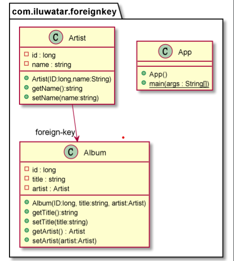

## Intent
Maps an association between objects to a foreign key reference between tables.

Key points:

- A Foreign Key Mapping maps an object reference to a foreign key in the database.

- In java programming, objects can refer to each other directly by object references.

- In a relational database, a FOREIGN KEY is a key used to link two tables together.

- In a relational database, a FOREIGN KEY is a field (or collection of fields) in one table that refers to the PRIMARY KEY in another table.

- The table containing the foreign key is called the child table, and the table containing the candidate key is called the referenced or parent table.

## Class diagram

## Applicability
Use the Foreign-Key-Mapping idiom when

* Each object contains the database key from the appropriate database table. If two objects are linked together with an association, this association can be replaced by a foreign key in the database.