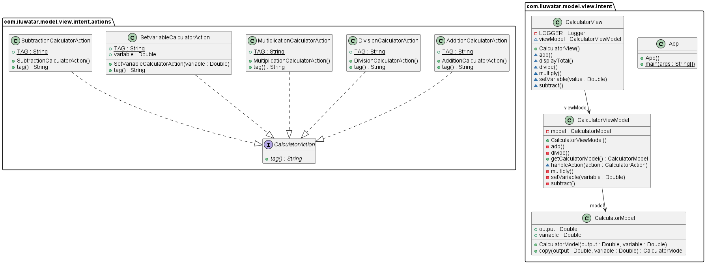

## Intent
MVI is a derivation of the original MVC architectural pattern. Instead of working with a 
proactive controller MVI works with the reactive component called intent: it's a component
which translates user input events into model updates.

## Class diagram

## Applicability
Use the Model-View-Intent pattern when

* You want to clearly separate the domain data from its user interface representation
* You want to minimise the public api of the view model

## Known uses
A popular architecture pattern in android. The small public api is particularly powerful 
with the new Android Compose UI, as you can pass a single method (viewModel::handleEvent) 
to all Composables(parts of UI) as a callback for user input event.

## Consequences
Pros:
* Encapsulation
* Separation of concerns
* Clear list of all possible user events

Cons:
* More boilerplate code compared to alternatives (especially in Java)

## Related patterns
MVC:
* [Trygve Reenskaug - Model-view-controller](http://en.wikipedia.org/wiki/Model%E2%80%93view%E2%80%93controller)
* [J2EE Design Patterns](https://www.amazon.com/gp/product/0596004273/ref=as_li_tl?ie=UTF8&camp=1789&creative=9325&creativeASIN=0596004273&linkCode=as2&tag=javadesignpat-20&linkId=48d37c67fb3d845b802fa9b619ad8f31)

## Credits

* [Model View Intent: a new Android Architecture Pattern](https://apiumacademy.com/blog/model-view-intent-pattern/)
* [MVI Architecture for Android Tutorial](https://www.kodeco.com/817602-mvi-architecture-for-android-tutorial-getting-started)

