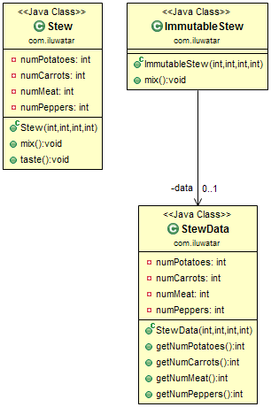

## Intent

Private Class Data design pattern seeks to reduce exposure of attributes by limiting their visibility. It reduces the number of class attributes by encapsulating them in a single Data object.

## Explanation

Real-world example

> Imagine you are cooking a stew for your family for dinner. You want to prevent your family members 
> from consuming the stew by tasting it while you are cooking, otherwise there will be no more stew 
> for dinner later.

In plain words

> Private class data pattern prevents manipulation of data that is meant to be immutable by 
> separating the data from the methods that use it into a class that maintains the data state.

Wikipedia says

> Private class data is a design pattern in computer programming used to encapsulate a class 
> attributes and their manipulation.

**Programmatic Example**

Taking our stew example from above. First, we have a `Stew` class where its data is not protected by 
private class data, making the stew's ingredient mutable to class methods. 

```java
public class Stew {
  private static final Logger LOGGER = LoggerFactory.getLogger(Stew.class);
  private int numPotatoes;
  private int numCarrots;
  private int numMeat;
  private int numPeppers;
  public Stew(int numPotatoes, int numCarrots, int numMeat, int numPeppers) {
    this.numPotatoes = numPotatoes;
    this.numCarrots = numCarrots;
    this.numMeat = numMeat;
    this.numPeppers = numPeppers;
  }
  public void mix() {
    LOGGER.info("Mixing the stew we find: {} potatoes, {} carrots, {} meat and {} peppers",
        numPotatoes, numCarrots, numMeat, numPeppers);
  }
  public void taste() {
    LOGGER.info("Tasting the stew");
    if (numPotatoes > 0) {
      numPotatoes--;
    }
    if (numCarrots > 0) {
      numCarrots--;
    }
    if (numMeat > 0) {
      numMeat--;
    }
    if (numPeppers > 0) {
      numPeppers--;
    }
  }
}
```

Now, we have the `ImmutableStew` class, where its data is protected by the `StewData` class. Now, the 
methods are unable to manipulate the data of the `ImmutableStew` class.

```java
public class StewData {
  private final int numPotatoes;
  private final int numCarrots;
  private final int numMeat;
  private final int numPeppers;
  public StewData(int numPotatoes, int numCarrots, int numMeat, int numPeppers) {
    this.numPotatoes = numPotatoes;
    this.numCarrots = numCarrots;
    this.numMeat = numMeat;
    this.numPeppers = numPeppers;
  }
  public int getNumPotatoes() {
    return numPotatoes;
  }
  public int getNumCarrots() {
    return numCarrots;
  }
  public int getNumMeat() {
    return numMeat;
  }
  public int getNumPeppers() {
    return numPeppers;
  }
}
public class ImmutableStew {
  private static final Logger LOGGER = LoggerFactory.getLogger(ImmutableStew.class);
  private final StewData data;
  public ImmutableStew(int numPotatoes, int numCarrots, int numMeat, int numPeppers) {
    data = new StewData(numPotatoes, numCarrots, numMeat, numPeppers);
  }
  public void mix() {
    LOGGER
        .info("Mixing the immutable stew we find: {} potatoes, {} carrots, {} meat and {} peppers",
            data.getNumPotatoes(), data.getNumCarrots(), data.getNumMeat(), data.getNumPeppers());
  }
}
```

Let's try creating an instance of each class and call their methods:

```java
var stew = new Stew(1, 2, 3, 4);
stew.mix();   // Mixing the stew we find: 1 potatoes, 2 carrots, 3 meat and 4 peppers
stew.taste(); // Tasting the stew
stew.mix();   // Mixing the stew we find: 0 potatoes, 1 carrots, 2 meat and 3 peppers
var immutableStew = new ImmutableStew(2, 4, 3, 6);
immutableStew.mix();  // Mixing the immutable stew we find: 2 potatoes, 4 carrots, 3 meat and 6 peppers
```

## Class diagram



## Applicability

Use the Private Class Data pattern when

* You want to prevent write access to class data members.
