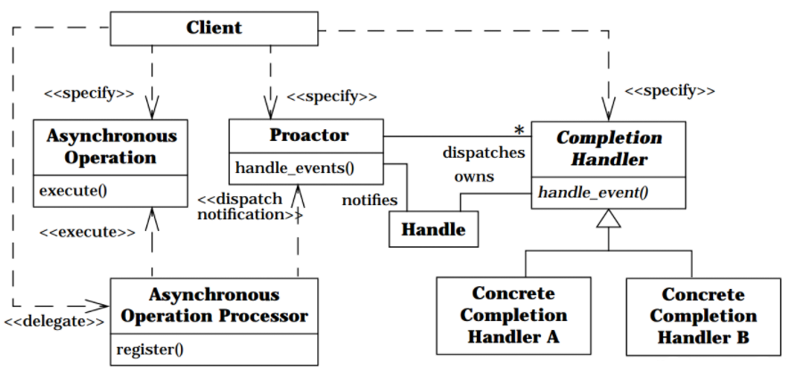

## Intent

Proactor pattern supports the demultiplexing and dispatching of multiple event handlers, which are triggered by the
completion of asynchronous events. This pattern simplifies asynchronous application development by integrating the
demultiplexing of completion events and the dispatching of their corresponding event handlers. 

In plain words

>When there is an internet
service program which needs to deal with many requests at the same time, an unblocking pattern just like proactor 
pattern is needed.

Wikipedia says

>Proactor is a software design pattern for event handling in which long running activities are running in an asynchronous part. A completion handler is called after the asynchronous part has terminated. The proactor pattern can be considered to be an asynchronous variant of the synchronous reactor pattern.

## Class diagram

## Applicability

Use this pattern when

* an application needs to perform one or more asynchronous operations without blocking the calling thread
* The application must be notified when asynchronous operations complete
* The application needs to vary its concurrency strategy independent of its I/O model
* The application will benefit by decoupling the application-dependent logic from the application independent
  infrastructure

## Real world examples

* [Boost.Asio](https://www.boost.org/doc/libs/1_76_0/doc/html/boost_asio.html)

## Related patterns

* [Reactor Pattern](https://java-design-patterns.com/patterns/reactor/)

## Credits

* [Proactor pattern](https://en.wikipedia.org/wiki/Proactor_pattern)
