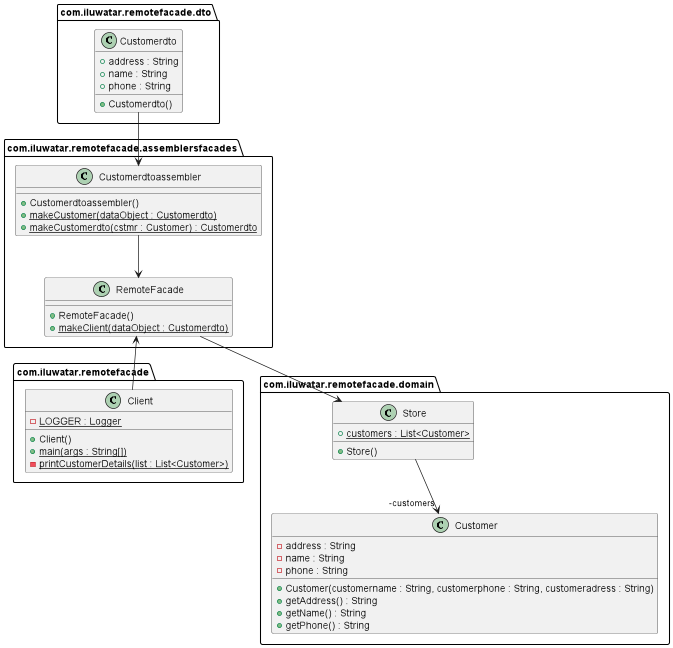

## Intent

Avoid using multiple calls to pass data for a user by making one single call.

## Explanation

Real world example

> We need to fetch information about customers from a remote database. Instead of making the
> calls one at a time for certain attributes, we use DTOs to transfer all the relevant attributes in a single call.

In plain words

> Using a DTO relevant information can be fetched with a single call by creating a facade.

Wikipedia says

> Has no information about this pattern.

**Programmatic Example**

Let's first introduce our simple `CustomerDTO` class.

```java
public class CustomerDTO {
    public  String name;
    public  String phone;
    public  String address;
}
```

`CustomerDTOAssembler` class acts as the server for customer information computing all logic.
Now using the `RemoteFacade` class since we have the DTOs. The methods take in the DTOs and compute any logic for them in the `Customerdtoassembler`

```java
    public class RemoteFacade {
    public static void makeClient(CustomerDTO dataObject){
        CustomerDTOAssembler.makeCustomer(dataObject);
    }
}
```
```java
public class Customerdtoassembler {
  public static Customerdto makeCustomerdto(Customer cstmr) {
    Customerdto customer = new Customerdto();
    customer.name = cstmr.getName();
    customer.phone = cstmr.getPhone();
    customer.address = cstmr.getAddress();
    return customer;
  }
  public static void updateCustomer(Customerdto dataObject) {
    Customer c = null;
    for (Customer cstmr : Domain.customers) {
      if (cstmr.getName().equals(dataObject.name)) {
        c = cstmr;
        break;
      }
    }
    if (c != null) {
      c.setAddress(dataObject.address);
      c.setPhone(dataObject.phone);
    }
  }
  public static void  makeCustomer(Customerdto dataObject) {
    Customer c = new Customer(dataObject.name, dataObject.phone, dataObject.address);
    Domain.customers.add(c);
  }
}

```
Now Fetching the details through the `Store` class where the DTOs are stored and calling them in the `Client` App.

```java
    import com.iluwatar.remotefacade.domain.Store;

public class Client {
    private static void printCustomerDetails(ArrayList<String> list) {
        list.forEach(customer -> LOGGER.info(Store.customers.toString()));
    }
}
```

## Class diagram

## Applicability

Use the Remote Facade Pattern pattern when:

* The client is requires related information.
* When boost in performance is required.
* The number of remote calls made need to be reduced.

## Credits

* [Design Pattern - Remote Facade](https://martinfowler.com/eaaCatalog/remoteFacade.html)
