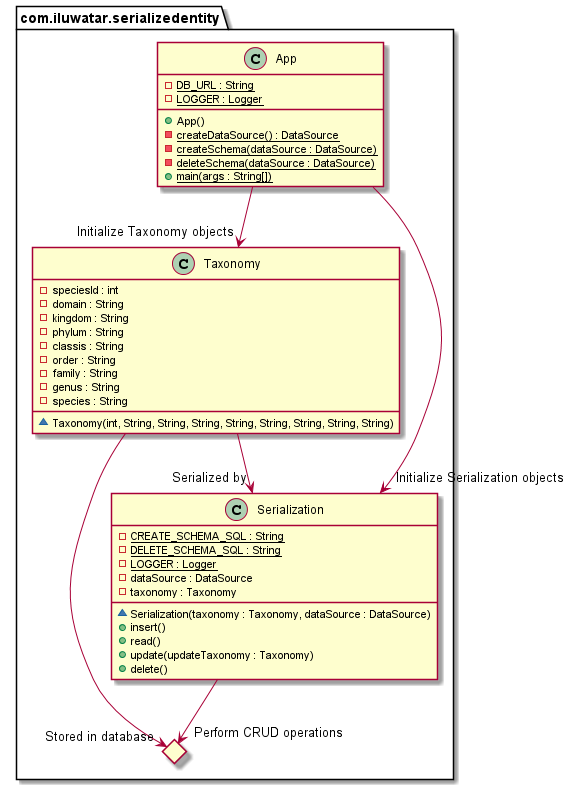

## Intent
Saves an object to a database in an efficient serialized form and retrieves/updates/deletes as needed.

## Explanation
Objects can be stored in a database for persistence. For efficiency, Java object serialization is used to translate 
the object into a set of bytes. The bytes are then stored in a database as binary large object and then read and 
reconstituted into the object when needed.

## Class Diagram


**Programmatic Example**
```java
@Setter
@Getter
@ToString
@EqualsAndHashCode
@AllArgsConstructor
public class Taxonomy implements Serializable {
    private int speciesId;
    private String domain;
    private String kingdom;
    private String phylum;
    private String classis;
    private String order;
    private String family;
    private String genus;
    private String species;
}

```

This pattern contains the data for the taxonomic definition of a living thing. The Serialization class serializes
the object and performs the basic database operations for the object.

The `Serialization` class:

```java
public class Serialization {
    private final DataSource dataSource;
    private final Taxonomy taxonomy;

    public Serialization(Taxonomy taxonomy, DataSource dataSource) {
        this.taxonomy = taxonomy;
        this.dataSource = dataSource;
    }

    public void insert() throws SQLException, IOException {
        ...
    }

    public void read() throws SQLException, IOException, ClassNotFoundException {
        ...
    }

    public void update(Taxonomy updateTaxonomy) throws SQLException, IOException {
        ...
    }

    public void delete() throws SQLException {
        ...
    }
}
```