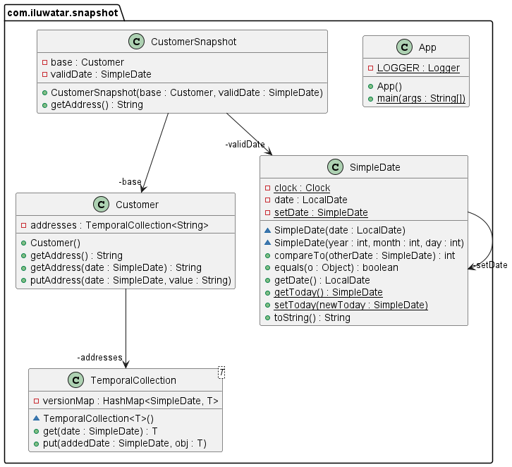

--- 
layout: pattern
title: Snapshot
folder: snapshot
permalink: /patterns/snapshot/
categories:
- creational 
  language: 
  tags:
- Data access
- Gang of Four
---

## Name / classification

Snapshot.

## Intent

Create a view of an object at a point in time.

## Explanation

Real world example

> Many people have phone numbers with details attached. A phone book, where registered phone 
> numbers with details are relieved are snapshots of the history of phone numbers, and their 
> associated details.

In plain words

> A snapshot is a copy of an object as it is at a point in time.

Wikipedia says

> The memento pattern is a software design pattern that exposes the private internal state of an 
> object. One example of how this can be used is to restore an object to its previous state 
> (undo via rollback), another is versioning, another is custom serialization.  

## Class diagram

## Applicability

Use the Snapshot pattern when
* You have an object with temporality and don't want to take that into 
account.

## Tutorials
* [Design Patterns - Memento Pattern](https://www.tutorialspoint.com/design_pattern/memento_pattern.htm)
 is a Snapshot tutorial as a Snapshot is a Memento without a caretaker.
  
## Known uses

* [java.util.Date](http://docs.oracle.com/javase/8/docs/api/java/util/Date.html)
 as Memento is a Snapshot with a caretaker.
## Consequences

Snapshot allows for removing the temporal aspects of an object with temporality.

## Related patterns
* [Memento](https://java-design-patterns.com/patterns/memento/)

## Credits
* [Martin Fowler](https://martinfowler.com/eaaDev/Snapshot.html)
