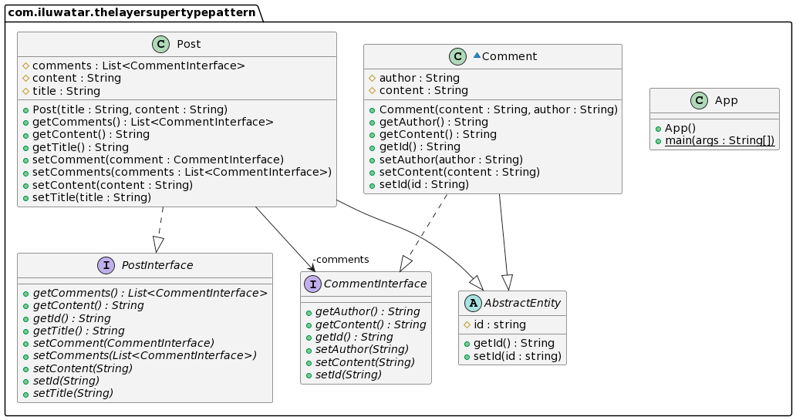

## Also known as

Kit

## Intent

针对不同Entity实体对象的相同属性或方法向上抽取, 减少过多的重复代码, 提供抽象能力, 保持简单和通用性

## Explanation

Real world example

> 手枪, 步枪, 狙击枪都有子弹规格的属性, 我们可以抽象一个枪的实体类拥有子弹规格的属性, 具体枪的类别都继承枪这个实体类, 所有枪的类别都能引用父类的子弹规格属性

In plain words

> 将相似子类进行抽象, 抽取公共属性和方法并继承, 减少重复代码的使用

Wikipedia says

> It’s not uncommon for all the objects in a layer to have methods you don’t want to have duplicated throughout the system. You can move all of this behavior into a common Layer Supertype.

**Programmatic Example**

这是Post和Comment类的公共父类Entity实体

```java
public abstract class AbstractEntity {

    protected String id;

    public String getId() {
        return id;
    }

    public void setId(String id) {
        if(id == null || id.length() < 3) {
            throw new IllegalArgumentException("id length must gte 10");
        }
        this.id = id;
    }
}
```

这是Post类和Comment实体

```java
public class Comment extends AbstractEntity implements CommentInterface {

    protected String content;
    protected String author;

    public Comment(String content, String author) {
        this.setContent(content);
        this.setAuthor(author);
    }

    @Override
    public void setId(String id) {
        if (this.getId() != null) {
            throw new IllegalArgumentException("The id for this comment has been set already.");
        }
        if (Integer.parseInt(id) < 1) {
            throw new IllegalArgumentException("The comment id must gte 1");
        }
        super.setId(id);
    }

    @Override
    public String getId() {
        return super.getId();
    }

    @Override
    public void setContent(String content) {
        if (content.length() < 2) {
            throw new IllegalArgumentException("The length of content must gte 2");
        }
        this.content = content;
    }

    @Override
    public String getContent() {
        return this.content;
    }

    @Override
    public void setAuthor(String author) {
        if (author.length() < 2) {
            throw new IllegalArgumentException("The length of author must gte 2");
        }
        this.author = author;
    }

    @Override
    public String getAuthor() {
        return this.author;
    }
}

public class Post extends AbstractEntity implements PostInterface {

    protected String title;
    protected String content;
    protected List<CommentInterface> comments = new ArrayList<>();

    /**
     * Post.
     *
     * @param title title
     * @param content content
     */
    public Post(String title, String content) {
        this.setTitle(title);
        this.setContent(content);
    }
    /**
     * @param title title.
     */
    @Override
    public void setTitle(String title) {
        if (title.length() < 2
                || title.length() > 100) {
            throw new IllegalArgumentException(
                    "The post title is invalid.");
        }
        this.title = title;
    }

    /**
     * @return title.
     */
    @Override
    public String getTitle() {
        return this.title;
    }

    /**
     * @param content content.
     */
    @Override
    public void setContent(String content) {
        if (content.length() < 2) {
            throw new IllegalArgumentException(
                    "The post content is invalid.");
        }
        this.content = content;

    }

    /**
     * @return content.
     */
    @Override
    public String getContent() {
        return this.content;
    }

    /**
     * @param comment comment.
     */
    @Override
    public void setComment(CommentInterface comment) {
        this.comments.add(comment);
    }

    /**
     * @param comments comments.
     */
    @Override
    public void setComments(List<CommentInterface> comments) {
        if(comments == null || comments.size() < 1) {
            throw new IllegalArgumentException("The length of comments must gte 1");
        }
        this.comments = comments;
    }

    /**
     * @return comments.
     */
    @Override
    public List<CommentInterface> getComments() {
        return this.comments;
    }
}
```
Here is how the whole app is put together.

```java
public static void main(String[] args) {
    PostInterface post = new Post("A sample post.", "This is the content of the post.");
    List<CommentInterface> commentInterfaces = new ArrayList<>();
    Comment comment1 = new Comment("One banal comment for the previous post.", "A fictional commenter");
    commentInterfaces.add(comment1);
    Comment comment2 = new Comment("Yet another banal comment for the previous post.", "A fictional commenter");
    commentInterfaces.add(comment2);
    post.setComments(commentInterfaces);

    LOGGER.info(post.getTitle() + ":" + post.getContent());
    for (CommentInterface commentInterface : post.getComments()) {
        LOGGER.info(commentInterface.getAuthor() + ":" +  commentInterface.getContent());
    }
}
```

Here is the console output.

```java
21:34:34.694 [main] INFO com.iluwatar.thelayersupertypepattern.App - A sample post.:This is the content of the post.
21:34:34.697 [main] INFO com.iluwatar.thelayersupertypepattern.App - A fictional commenter:One banal comment for the previous post.
21:34:34.698 [main] INFO com.iluwatar.thelayersupertypepattern.App - A fictional commenter:Yet another banal comment for the previous post.
```

## Class diagram




## Applicability

Use the Layer Supertype pattern when

* 每个实体类有相同类型相同名称的属性
* 每个实体类有相同返回值, 相同参数, 相同名称的方法

Example use cases	

* Selecting to call to the appropriate implementation of FileSystemAcmeService or DatabaseAcmeService or NetworkAcmeService at runtime.
* Unit test case writing becomes much easier
* UI tools for different OS

## Tutorial

* [The Layer Supertype Pattern](https://www.sitepoint.com/the-layer-supertype-pattern-encapsulating-common-implementation-in-multi-tiered-systems/) 
